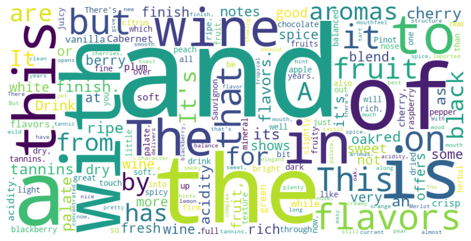

# Wine Dataset Analysis

## Overview

This project involves exploratory data analysis (EDA) and insights generation using a **Wine dataset**. The goal is to uncover patterns, relationships, and trends in the data to inform decision-making.

## Dataset Information

- **Dataset Name**: Wine Dataset
- **File Format**: CSV
- **Columns**: The dataset contains various columns representing attributes such as wine quality, price, region, etc.
- **Size**: Varies depending on the provided file.

## Analysis Performed

### 1. Data Preprocessing
- **Checked for Missing Values**: Identified and handled missing or null values in the dataset.
- **Data Cleaning**: Ensured all fields were consistent and free from outliers.

### 2. Exploratory Data Analysis (EDA)
- **Descriptive Statistics**: Summarized the dataset using mean, median, mode, etc.
- **Distribution Analysis**: Visualized the distributions of numerical columns using histograms and KDE plots.
- **Correlation Analysis**: Examined relationships between numerical variables using correlation matrices and heatmaps.

### 3. Word Cloud Visualization
- **Word Cloud**: Generated a word cloud to visualize the most frequently occurring words in the `description` column of the dataset.
- Below is an example of the word cloud generated:
  
  

### 4. Insights
- Identified trends and patterns in the data, such as:
  - Relationships between wine quality and price.
  - Variations across regions or wine types.
  - Highlighted potential areas for further research or modeling.

## Visualization Tools
- Used libraries such as **Matplotlib**, **Seaborn**, and **WordCloud** to create:
  - Histograms
  - Boxplots
  - Heatmaps
  - Bar charts
  - Word Cloud

## Requirements

- **Python 3.x**
- Libraries:
  - pandas
  - numpy
  - matplotlib
  - seaborn
  - wordcloud

## Usage

1. Clone this repository:
   ```bash
   git clone https://github.com/your-repo/wine-analysis.git
